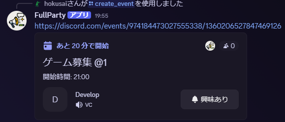
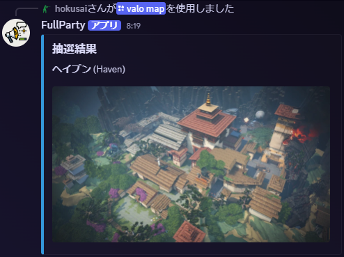

# FullParty
いつものゲームライフを少し便利にするDiscord Bot  
[インストールリンク](https://discord.com/oauth2/authorize?client_id=1359855799676960930&permissions=17602923464704&integration_type=0&scope=bot+applications.commands)

## ゲーム募集 `fp`
ゲーム募集用のイベントを作成する機能

### Command
* #### `/fp create`
  ゲーム募集用のイベントを作成する。
  なお、引数を指定せず初期値のまま実行した場合はいわゆる「@4 21:00~」となる。   
  作成されるイベントは以下の通り   
     
  参加したい場合は「YES」、参加できない場合は「NO」をクリックする。   
  また、募集人数に到達した場合に完了メッセージを送信する。いわゆる「〆」

* #### `/fp init`
  イベント作成時のデフォルトVCを設定する。設定できていない場合は`/create_event`が実行できない。

### Task
* 作成から一定期間経過したイベントを自動消去する。

## VALORANT関連 `valo`
VALORANT関連の便利機能

### Command
* #### `/valo map`
  マップの抽選実施し以下のようなメッセージを出力する。   
     
