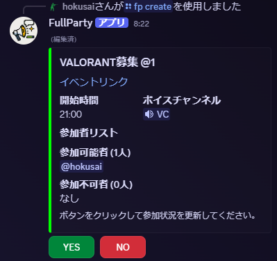

# FullParty
いつものゲームライフを少し便利にするDiscord Bot  
[インストールリンク](https://discord.com/oauth2/authorize?client_id=1359855799676960930&permissions=11005855744&integration_type=0&scope=bot+applications.commands)

## ゲーム募集
ゲーム募集用のイベントを作成する機能

### Command
* #### `/create_event`
  Discord標準のイベント機能をベースにゲーム募集専用のイベントを作成する。   
  なお、引数を指定せず初期値のまま実行した場合はいわゆる「@4 21:00~」となる。   
  作成されるイベントは以下のようなものになり、参加したい場合は「興味あり」ボタンをクリックする。
  

* #### `/set_channel`
  イベント作成時のデフォルトVCを設定する。設定できていない場合は`/create_event`が実行できない。

### Task
* 募集人数に到達した場合に完了メッセージを送信する。いわゆる「〆」
* 作成から一定期間経過したイベントを自動消去する。
